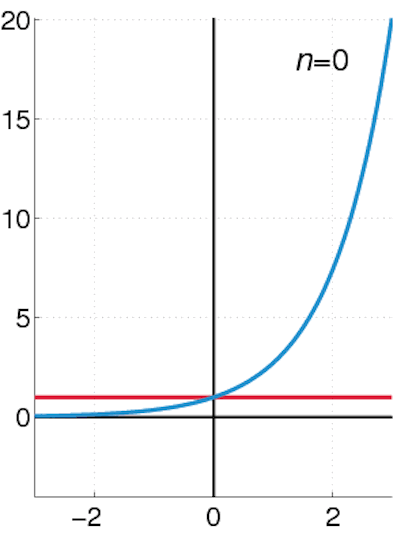

# Taylor Series and Convergence

This project explores how Taylor series can be used to approximate functions, how convergence works, and where Taylor approximation succeed or fail.

## 1. Introduction
Taylor series are approximations around a local point that turn non-polynomial functions into polynomial functions using all orders of the function's derivatives at that point.

## 2. Definitions and Basics
The Taylor series of a function $f(x)$ centered at $a$ is given by:

[Taylor Series Formula] 

$$f(x) = \sum_{n=0}^\infty \frac{f^{(n)}(a)}{n!} {(x-a)}^n$$

SPECIAL CASE:
When $a$ = 0,
We use the Maclaurin series; series identical to Taylor series with $a$ evaluated as 0.

Radius of convergence is the range where the series equals the function’s values. Outside the radius of convergence, the series diverges from the function’s behavior.

Mclaurin series for:

1. $f(x)$ = $e^x$

$e^x$ = 1 + $x$ + $\frac{x^2}{2!}$ + $\frac{x^3}{3!}$ + $\frac{x^4}{4!}$ .... + $\frac{x^n}{n!}$ (the series converges for all real numbers since the series as a whole converges for every $x$)

2. $f(x)$ = $sin(x)$

$sin(x)$ = 0 + $x$ - $x^3$ + $x^5$ - $x^7$ ..... + $(-1)^{n-1}(x^{n-1})$ + $(-1)^n x^n$ (The series converges for all $x$ based on applying the ratio test, which shows the radius of convergence is infinite)

3. $f(x)$ = $ln(x+1)$

$ln(x+1)$ = 0 + $x$ - $\frac{x^2}{2}$ + $\frac{x^3}{3}$ - $\frac{x^4}{4}$ ...... + $(-1)^{n-1} (\frac{x^{n-1}}{n-1})$ + $(-1)^n \frac{x^n}{n}$(convergence range: (-1,1])

## 3. Visualization and Error

In the previous sections, I defined Taylor and Maclaurin series and wrote down some concrete examples. In this section, I focus on how Taylor polynomials actually behave when graphed, how the approximation improves as the degree increases, and how the idea of an “error term” helps measure how good the approximation is.

### 3.1 How the approximation improves with higher degree

To see what a Taylor polynomial is really doing, it is useful to fix one function and compare several of its Taylor polynomials of different degrees.

For this section, I use all three functions from section 2 as a running example. As I increase the degree, two things happen:

1. The polynomial becomes a better match near the center.
2. The interval around the center where the polynomial stays close to the original function becomes wider.

$e^x$:

$sin(x)$:
.gif)

$ln(x)$:
.gif)

If I look at the degree 1 polynomial (a tangent line approximation), it matches the function only very close to the center; moving even a little away, the line drifts off quickly. A degree 2 or degree 3 polynomial already follows the curvature of the function much better and stays close over a noticeably larger interval. For degree 5 or higher, the graph of the polynomial and the graph of the function often overlap so well near the center that it is hard to distinguish them by eye.

However, even high degree polynomials are not perfect. Far enough away from the center, the polynomial usually starts to misbehave: it may grow too fast, oscillate differently, or simply fail to follow the function’s shape. This illustrates a key idea: Taylor polynomials are local approximations. They are designed to be accurate near the center point, not necessarily everywhere.

### 3.2 Error and the remainder term

The gifs give an intuitive sense of how close the Taylor polynomial is to the original function, but in analysis we want a more precise way to talk about this difference. For a fixed degree $n$, the difference between the true function and the $n$th degree Taylor polynomial is called the remainder or error term.

If $T_n(x)$ denotes the Taylor polynomial of degree $n$ for $f(x)$ centered at some point $a$, then the error at a point $x$ is

${Error}(x)$ = $f(x) - T_n(x)$

Instead of just saying “the graphs look close,” we want to know how large this error can be. There is a general expression (often called the Lagrange form of the remainder) that bounds the error using:

- The next derivative of the function (the derivative of order \( n + 1 \))
- The distance between $x$ and the center $a$
- A factorial term $(n+1)!$ in the denominator

The important qualitative facts are:

- For a fixed $x$, if we increase the degree $n$, the size of the error term typically decreases, as long as we stay inside the radius of convergence.
- For a fixed degree $n$, if we move $x$ closer to the center $a$, the error becomes smaller. This matches the idea that Taylor polynomials give the best approximation near the center point where they are constructed.
- Outside the radius of convergence, even if we increase $n$, the Taylor polynomials do not necessarily approximate the function at all; the error does not go to zero.

These observations connect the visual behavior from the graphs with the theoretical concept of error. Near the center and inside the interval of convergence, increasing the degree makes the error small, which is why the graphs almost overlap. Outside that interval, the error does not vanish, which explains why the polynomial and the original function can look completely different there.

## 4. Deeper Questions

So far I have treated Taylor and Maclaurin series as powerful tools that approximate “nice” functions very well. In this section, I look more closely at the limits of this idea: what happens at “bad” points like the origin for `ln(x)`, what it really means to go outside the radius of convergence, and why not every smooth function is determined by its Taylor series.

### 4.1 Why `ln(x)` fails at 0, but `ln(1 + x)` works

A Taylor series centered at a point `a` is built out of the function and all of its derivatives evaluated at `a`. For that to even make sense, two basic conditions must hold:

1. The function has to be defined at `a`.
2. The function has to be differentiable (in fact, infinitely differentiable) in some neighborhood around `a`.

The natural logarithm `ln(x)` immediately breaks the first condition at `x = 0`: it is only defined for `x > 0`. There is no way to evaluate `ln(0)` or its derivatives at `0`, so a Taylor series centered at `0` is not just “bad” or “divergent” – it is simply not defined. In complex analysis language, `x = 0` is a singularity for `ln(x)`.

In contrast, the function `ln(1 + x)` behaves very differently at `x = 0`. It is defined at `x = 0`, differentiable there, and in fact infinitely differentiable on an interval containing `0` (for example, on `(-1, 1]`). This is why a Maclaurin series for `ln(1 + x)` exists and why I was able to compute its radius of convergence. The difference between `ln(x)` and `ln(1 + x)` at the origin is really a difference in domain and smoothness:

- `ln(x)` has a “hole” at `x = 0` and cannot be expanded there.
- `ln(1 + x)` is perfectly smooth at `x = 0` and admits a convergent Maclaurin series.

This illustrates a general point: Taylor series are local objects. They only make sense at points where the function is well behaved and where all derivatives exist. If the function has a singularity or a discontinuity at the center, there is no Taylor series to talk about.

### 4.2 What really happens outside the radius of convergence

For a power series centered at a point `a`, the ratio or root test usually gives a condition of the form

`|x - a| < R`

where `R` is called the radius of convergence. Inside this open interval, the infinite series in powers of `(x - a)` converges. At this stage it is tempting to think of `R` as just a technical detail from a test, but it has a very concrete meaning:

- Inside `|x - a| < R`, the Taylor series behaves well. The partial sums (the Taylor polynomials) get closer and closer to the true function, and the error tends to zero as the degree goes to infinity.
- Outside `|x - a| < R`, the Taylor series fails as an infinite sum. The sequence of partial sums does not converge; it may blow up, oscillate, or just fail to settle to any finite value. In this region, the Taylor series does not represent the function at all.
- At the points where `|x - a| = R`, the ratio or root test is inconclusive, so each endpoint has to be checked separately using other convergence tests.

The Maclaurin series for `ln(1 + x)` is a concrete example of this behavior. Using the ratio test, I found that the series converges when `|x| < 1`, which means the radius of convergence is `R = 1` and the open interval of guaranteed convergence is `(-1, 1)`. Testing the endpoints shows that:

- At `x = 1`, the series becomes an alternating harmonic series, which converges.
- At `x = -1`, the series collapses to (essentially) the harmonic series with all terms the same sign, which diverges.

So in this case, the full interval of convergence is `(-1, 1]`. Inside this interval, the Taylor polynomials for `ln(1 + x)` approximate the function better and better as the degree increases. Outside this interval, the infinite series in powers of `x` does not converge at all, even though individual low-degree Taylor polynomials might still look reasonable on a graph for a while.

This explains the behavior I saw in the visualizations: the region where high-degree Taylor polynomials track the function closely matches the interval where the series actually converges. Once I move beyond that region, no amount of increasing the degree will make the Taylor series represent the function correctly as an infinite sum.

### 4.3 When Taylor series converge but do not equal the function

So far, the examples in this project have been “nice” in the sense that when the Taylor series converges, it converges to the original function on the whole interval of convergence. Functions like `e^x` and `sin(x)` are like this: they are called analytic, meaning that they are equal to their Taylor series on some interval around the center.

However, not every smooth function is analytic. There are functions that are infinitely differentiable at a point, but whose Taylor series at that point does not represent the function except at a single point. In other words:

- All derivatives exist at the center.
- The Taylor series built from those derivatives converges.
- But the limit of that series is not the original function on any open interval around the center.

One classic example (from more advanced analysis) is a function that is defined to be `0` at the center and away from the center decays extremely fast, so that every derivative at the center is equal to `0`. The Taylor series at that point is then just the zero series. The series converges everywhere, but it only matches the function at the single point where it was constructed; away from that point, the actual function is not zero.

This phenomenon shows that:

- Being infinitely differentiable is not enough to guarantee that a function equals its Taylor series.
- To be fully captured by its Taylor expansion, a function needs to be analytic, not just smooth.

From the point of view of approximation, this is important. In many standard cases (like exponentials, trigonometric functions, and logarithms away from their singularities), the Taylor series is a very reliable tool. But there are also functions where the Taylor series hides most of the function’s behavior instead of revealing it. Understanding where Taylor series work, where they fail because of domain and singularities, and where they fail even in the presence of infinite differentiability is a key step toward seeing the limits of this technique.

In the context of this project, the examples with `ln(1 + x)` already show the impact of domain and radius of convergence. The more pathological smooth examples belong to a deeper level of analysis, but they indicate that Taylor series are not a universal language for all functions, only for a special class of very well-behaved ones.

## 5. Reflection and Future Directions

This project started as a review of Taylor and Maclaurin series but quickly turned into something deeper. At the beginning, I mainly thought of Taylor series as a neat trick: expand a function into a polynomial, plug in numbers, and get approximations. Working through definitions, examples, convergence, and graphs forced me to confront how many hidden conditions are sitting behind that “trick.”

One of the main ideas that became clearer was the role of the **center** and the **radius of convergence**. Formally, I already knew that power series converge only on some interval, but it felt like a technical detail from the ratio test. After computing the radius of convergence for specific series and then matching that interval to what I saw on the graphs, it became obvious that this radius is not just an abstract number: it literally marks where the infinite Taylor series is allowed to represent the function. Inside that region, higher-degree Taylor polynomials really do behave like better and better approximations. Outside it, increasing the degree does not fix the approximation; the infinite series itself simply fails.

Another conceptual shift came from thinking about **“good” vs “bad” points**. The example of `ln(x)` at `x = 0` versus `ln(1 + x)` at `x = 0` made it clear that Taylor series are not a global language; they are local expansions around points where the function is well behaved. If the function has a singularity or is not even defined at the center, there is nothing to expand. On the other hand, a function like `ln(1 + x)` can be perfectly smooth at the origin but still have a limited radius of convergence because of a singularity farther away. The boundary of analyticity shows up directly in the convergence behavior of the Taylor series.

The discussion of functions that are infinitely differentiable but not equal to their Taylor series hinted at an even sharper distinction between **smooth** and **analytic** functions. In standard calculus problems, these two notions are often blurred together, but they are not the same. A function can have derivatives of all orders and still not be determined by its Taylor series. I did not construct explicit examples in this project, but just knowing such functions exist makes the usual “expand into a Taylor series” step feel less automatic and more conditional.

There are several natural directions to extend this project:

- Study Taylor series from the point of view of **complex analysis**, where analyticity and singularities are even more tightly controlled, and where the geometry of the complex plane constrains the radius of convergence.
- Compare Taylor series to other approximation tools, such as **Fourier series** or **Chebyshev polynomials**, and see how the notion of “best approximation” changes depending on the setting.
- Look at how Taylor series appear inside **numerical methods** (for example, error estimates in numerical integration or differential equation solvers) and how theoretical error bounds translate to practical accuracy.
- Explore explicit examples of smooth but non-analytic functions and analyze why their Taylor series fail to capture their behavior beyond a single point.

Overall, this project shifted my view of Taylor series from a computational technique into a more structural object: a local power-series “snapshot” of a function that works extremely well in the right setting and fails completely outside it. In future projects, I plan to revisit Taylor series in more advanced contexts and connect them with other areas of analysis and approximation theory.

## 6. References
### 6.1 Online explanations
- Grant Sanderson (3Blue1Brown), *“Taylor series | Chapter 11, Essence of Calculus,”* ...

### 6.2 Visuals and animations
- “GIF showing how well e^x is matched by first n terms of its Taylor series,” r/educationalgifs...
- “Taylor Series Gifs,” Calculus II materials by R. Stephens, Colgate University...
- Jakob Scholbach, *“Taylor approximation of natural logarithm”* (animated GIF), Wikimedia Commons...
