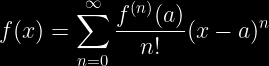

# Taylor Series and Convergence

This project explores how Taylor series can be used to approximate functions, how convergence works, and where Taylor approximation succeed or fail.

## 1. Introduction
Taylor series are approximations around a local point that turn non-polynomial functions into polynomial functions using all orders of the function's derivatives at that point.

## 2. Definitions and Basics
The Taylor series of a function $f(x)$ centered at $a$ is given by:

SPECIAL CASE:
When $a$ = 0,
We use the Maclaurin series; series identical to Taylor series with $a$ evaluated as 0.

Radius of convergence is the range where the series equals the function’s values. Outside the radius of convergence, the series diverges from the function’s behavior.

Mclaurin series for (lim n-> ∞):

1. $f(x)$ = e^x

$e^x$ = 1 + x + x^2/2! + x^3/3! + x^4/4! .... + x^n/n! (no convergence range since the limit of the series converges to 0)

2. $f(x)$ = sin(x)

$sin(x)$ = 0 + x - x^3 + x^5 - x^7 ..... (no convergence range because the limit of Mclaurin polynomial is 0)

3. $f(x)$ = ln(x+1)

$ln(x+1)$ = 0 + x - x^2/2 + x^3/3 - x^4/4 ...... (convergence range: [-1,1])

## 3. Visualization and Error
- How the approximation improves with higher-degree polynomials
- Graphs comparing function vs. Taylor approximation
- Error term (briefly)

## 4. Deeper Questions
- Why does the Taylor series of ln(x) fail at x=0?
- What happens outside the radius of convergence?

## 5. Python/Desmos Simulation (Optional)
- Plot f(x) and its Taylor approximations for eˣ or sin(x)

## 6. Reflection
- What did I learn?
- Why is this interesting?

## 7. References
- Link to notes, videos, or books you used
